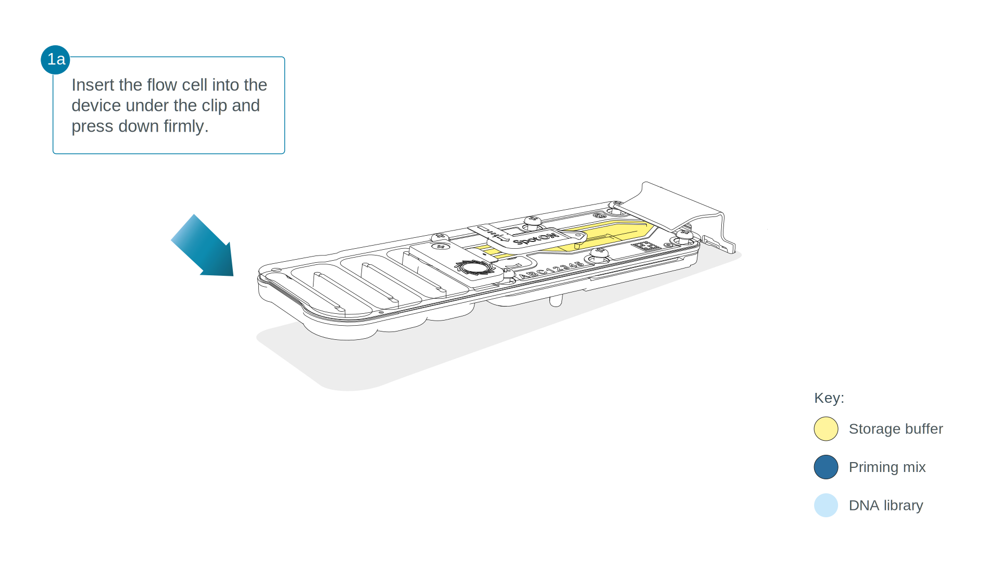
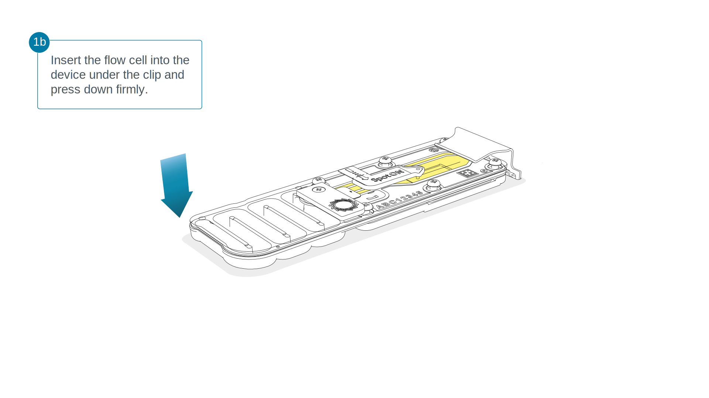
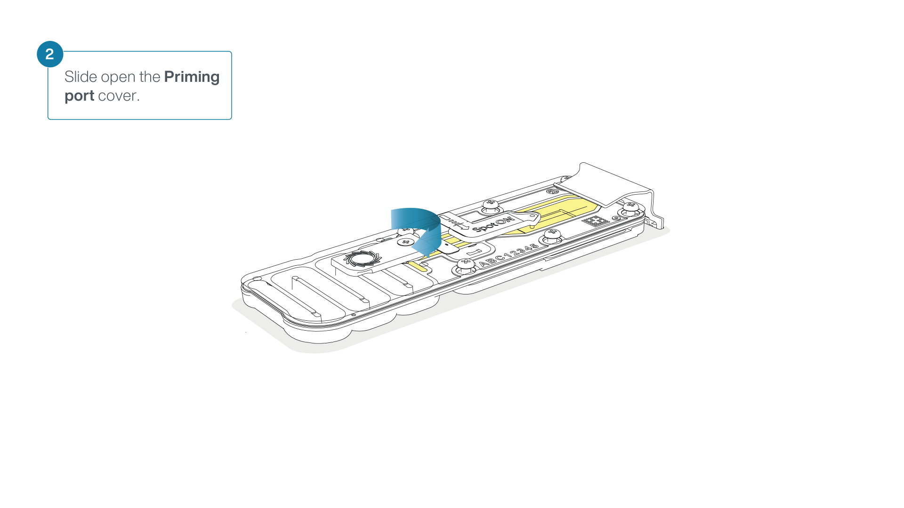
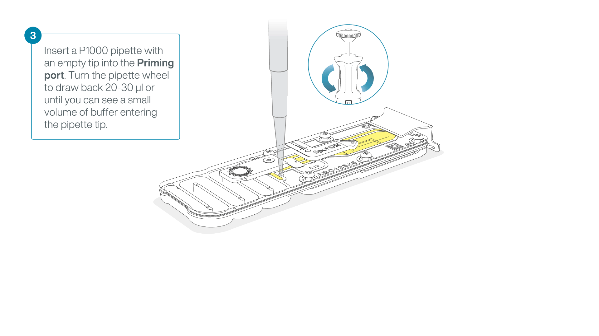
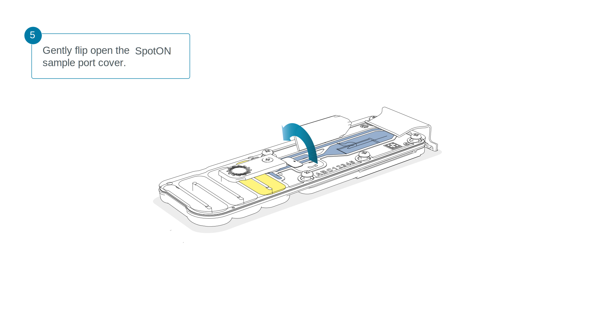
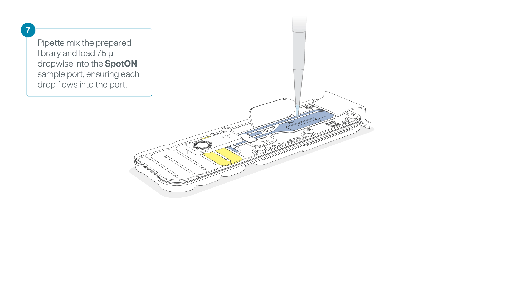
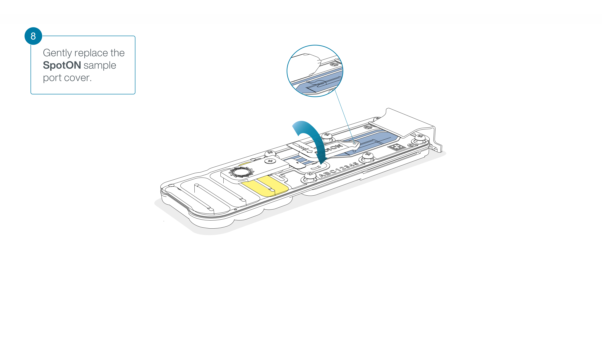
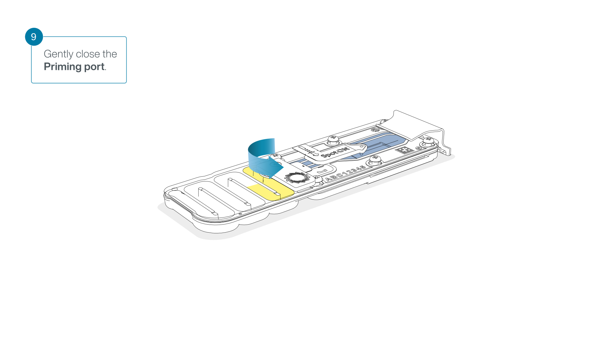

```{r include=F}
source(paste0(params$local, "dependencies/setup.R"))
opts_chunk$set(message = FALSE,
               warning = FALSE,
               echo    = FALSE,
               include = TRUE,
               eval    = TRUE)
```

# Introduction to the Protocol

```{r}
supplies <- bind_rows(
  tibble(
    Step = rep("All", 7),
    Category = rep("Equipment", 7),
    Item = c("MinION Device",
             "Qubit fluorometer",
             "Thermal cycler",
             "Hula mixer",
             "Magnetic rack",
             "Microfuge",
             "Ice bucket or freezy block"),
    Manufacturer = c("ONT", "Invitrogen", rep("NA", 5)),
    Catalog = rep("NA", 7)
  ),
  tibble(
    Step = rep("All", 2),
    Category = rep("Kit", 2),
    Item = c("Ligation Sequencing Kit V14", "NEBNext Companion Module v2 for ONT Ligation Sequencing"),
   Manufacturer = c("ONT", "NEB"),
      Catalog = c("SQK-LSK114", "E7672S")
  ),
  tibble(Step     = c("End_Prep"),
    Category = c("Other"),
    Item = c("1 µg (or 100-200 fmol) high molecular weight genomic DNA"),
    Manufacturer = c("NA"),
    Catalog = c("NA")),
    
  tibble(Step     = rep("End_Prep", 10),
    Category = rep("Materials", 10),
    Item = c("DNA Control Sample",
             "AMPure XP Beads",
             "NEBNext® FFPE DNA Repair Buffer v2",
             "NEBNext® Ultra II End Prep Enzyme Mix",
             "Qubit dsDNA HS Assay Kit",
             "Nuclease-free water",
             "Freshly prepared 80% ethanol in nuclease-free water",
             "Qubit™ Assay Tubes",
             "0.2 ml thin-walled PCR tubes",
             "1.5 ml Eppendorf DNA LoBind tubes"),
    Manufacturer = c("ONT", "ONT", "NEB", "NEB", "Invitrogen", "Any", "Any", "Invitrogen", "Any", "Any"),
    Catalog = c("NA", "NA", "E7672S/M6630", "E7672S/E7363", "Q32851", "NA", "NA", "Q32856", "NA", "NA")),
  tibble(
    Step     = rep("Adapter_Ligation", 4),
    Category = rep("Materials", 4),
    Item  = c("Ligation Adapter (LA)",
                 "Ligation Buffer (LNB)",
                 "Long Fragment Buffer (LFB)",
                 "Short Fragment Buffer (SFB)"), 
    Manufacturer = rep("ONT", 4),
    Catalog = rep("NA", 4)),
  tibble(
    Step     = rep("Adapter_Ligation", 2),
    Category = rep("Consumables", 2),
    Item  = c("Salt-T4® DNA Ligase",
                 "1.5 ml Eppendorf DNA LoBind tubes"),
    Manufacturer = c("NEB",
                     "Any"),
    Catalog = c("M0467",
                "NA")),
  tibble(
    Step    = rep("Library_Cleanup", 2),
    Category = rep("Materials", 2),
    Item = c("AMPure XP Beads (AXP)",
                "Elution Buffer (EB)"), 
    Manufacturer = rep("ONT", 2),
    Catalog = rep("NA", 2)),
  tibble(
    Step    = rep("Library_Cleanup", 3),
    Category = rep("Consumables", 3),
    Item = c("1.5 ml Eppendorf DNA LoBind tubes",
                "Qubit dsDNA HS Assay Kit",
                "Qubit™ Assay Tubes"),
    Manufacturer = c("Any",
                     "Invitrogen",
                     "Invitrogen"),
    Catalog = c("NA",
                "Q32851",
                "Q32856")),
  tibble(
    Step    = rep("Load_Flowcell", 5),
    Category = rep("Materials", 5),
    Item = c("Flow Cell Flush (FCF)",
             "Flow Cell Tether (FCT)",
             "Library Solution (LIS)",
             "Library Beads (LIB)",
             "Sequencing Buffer (SB)"),
    Manufacturer = rep("ONT", 5),
    Catalog = rep("NA", 5)),
  tibble(
    
    Step    = rep("Load_Flowcell", 3),
    Category = rep("Consumables", 3),
    Item     = c("MinION Flow Cell",
                 "Bovine Serum Albumin (BSA) (50 mg/ml)",
                 "1.5 ml Eppendorf DNA LoBind tubes"),
    Manufacturer = c("ONT", rep("Any", 2)),
    Catalog = rep("NA", 3)
    )
) %>%
  
  mutate(Category = factor(Category, levels = c("Equipment", "Kit", "Materials", "Consumables", "Other"), ordered = T),
         Step     = factor(Step, levels = c("All", "End_Prep", "Adapter_Ligation", "Library_Cleanup", "Load_Flowcell"), ordered = T)) %>%
  arrange(Step, Category, Manufacturer)

```

```{r}
supplies %>% filter(Step == "All") %>%
  select(-Step) %>%
  mutate(Manufacturer = if_else(Manufacturer == "NA", "", Manufacturer),
         Catalog      = if_else(Catalog      == "NA", "", Catalog)) %>%
  gt(groupname_col = "Category") %>%
  cols_label(Item ~ "",
             Manufacturer ~ "",
             Catalog ~ "") %>%
  tab_header("Equipment & Kits Across All Steps") %>%
  tab_style(style = cell_text(align = "left"), locations = cells_title()) %>%
  tab_style(style = cell_text(weight = "bold", transform = "uppercase"), locations = cells_row_groups()) %>%
  tab_style(style = cell_text(indent = 25), locations = cells_body(columns = "Item")) %>%
  opt_stylize(6, "pink")
```

```{r}
input <- tibble(
  min_kb = c(0, 1, 10),
  max_kb = c(1, 10, 100),
  input  = c("200 fmol",
             "100-200 fmol",
             "1 ug")) %>%
gt() %>%
  tab_header(title = "Input DNA Amounts") %>%
  cols_label(min_kb ~ "Length of Target",
             input  ~ "Template Needed") %>%
  cols_merge(columns = c("min_kb", "max_kb"),
             pattern = "{1} kb - {2} kb") %>%
  fmt_units(columns = everything()) %>%
  cols_align("left", columns = everything()) %>%
  tab_style(locations = cells_title(), style = list(
                                              cell_text(align = "left",
                                                         size = "medium"))) %>%
  opt_stylize(4, color = "cyan")

input
```

```{r}
SQK.LSK114.contents <- tibble(
    abbrev  = c("DCS", "LA", "LNB", "LFB", "SFB", "AXP", "SB", "EB", "LIB", "LIS", "FCF", "FCT"),
    reagent = c("DNA Control Strand", "Ligation Adapter", "Ligation Buffer", "Long Fragment Buffer", "Short Fragment Buffer", "AMPure XP Beads", "Sequencing Buffer", "Elution Buffer", "Library Beads", "Library Solution", "Flow Cell Flush", "Flow Cell Tether"),
    color   = c("yellow", "green", "lightgray", "orange", "gray", "brown", "red", "black", "magenta", "pink", "blue", "purple")
  ) %>%
gt() %>%
  tab_header("SQK-LSK114 Contents") %>%
  tab_source_note(html(local_image(filename = "attachments/SQK-LSK114_tubes.svg", height = 200))) %>%
  tab_style_body(style   = cell_fill(color = from_column("color")),
                 columns = "abbrev",
                 pattern = ".") %>%
  cols_label(abbrev ~ "", reagent ~ "") %>%
  cols_hide(color) %>%
  opt_table_lines("none") %>%
  tab_style(locations = cells_title(), style = cell_text(align = "left", size = "medium")) %>%
  opt_horizontal_padding(1.5)

SQK.LSK114.contents
```

# DNA Repair and End-prep

```{r}
supplies %>% filter(Step == "End_Prep") %>%
  select(-Step) %>%
  mutate(Manufacturer = if_else(Manufacturer == "NA" | Manufacturer == "Any", "", Manufacturer),
         Catalog      = if_else(Catalog      == "NA" | Catalog == "Any", "", Catalog)) %>%
  gt(groupname_col = "Category") %>%
  cols_label(Item ~ "",
             Manufacturer ~ "",
             Catalog ~ "") %>%
  tab_header("Materials & Supplies", subtitle = "DNA Repair & End Prep") %>%
  tab_style(style = cell_text(align = "left"), locations = cells_title()) %>%
  tab_style(style = cell_text(weight = "bold", transform = "uppercase"), locations = cells_row_groups()) %>%
  tab_style(style = cell_text(indent = 25), locations = cells_body(columns = "Item")) %>%
  opt_stylize(6, "pink")
```

```{r}
steps <- tibble(
Stage = "DNA Repair and End-prep",
Step  = c(
"Prepare the NEB reagents in accordance with manufacturer’s instructions, and place on ice.",
"Prepare the DNA in nuclease-free water.",
"Prepare the End Repair Reaction"),
Order = c(1:3)) %>%
  bind_rows(
    tibble(
      Stage = "Adapter Ligation",
      Step = c(
        "Prepare the Ligation Reaction",
      ),
      Order = 1
    )
  )
```

```{r}
substeps <- tibble(
  Step = "Prepare the NEB reagents in accordance with manufacturer’s instructions, and place on ice.",
  Substeps = c(
  "Thaw all reagents on ice.",
  "Flick and/or invert the reagent tubes to ensure they are well mixed."),
      Substep_Order = c(1:2)) %>%
  bind_rows(
    tibble(
      Step = "Prepare the DNA in nuclease-free water.",
      Substeps = c(
        "Transfer 1 μg (or 100-200 fmol) input DNA into a 1.5 ml Eppendorf DNA LoBind tube.",
        "Adjust the volume to 47 μl with nuclease-free water.",
        "Mix thoroughly by pipetting up and down, or by flicking the tube",
        "Spin down briefly in a microfuge."),
      Substep_Order = c(1:4))) %>%
  bind_rows(
    tibble(
      Step = "Prepare the End Repair Reaction",
      Substeps = c(
"Using a thermal cycler, incubate at 20°C for 5 minutes and 65°C for 5 minutes.",
"Resuspend the AMPure XP Beads (AXP) by vortexing.",
"Transfer the DNA sample to a clean 1.5 ml Eppendorf DNA LoBind tube.",
"Add 60 µl of resuspended the AMPure XP Beads (AXP) to the end-prep reaction and mix by flicking the tube.",
"Incubate on a Hula mixer (rotator mixer) for 5 minutes at room temperature.",
"Prepare 500 μl of fresh 80% ethanol in nuclease-free water.",
"Spin down the sample and pellet on a magnet until supernatant is clear and colourless. Keep the tube on the magnet, and pipette off the supernatant.",
"Keep the tube on the magnet and wash the beads with 200 µl of freshly prepared 80% ethanol without disturbing the pellet. Remove the ethanol using a pipette and discard.",
"Repeat the previous step.",
"Spin down and place the tube back on the magnet. Pipette off any residual ethanol. Allow to dry for 30 seconds, but do not dry the pellet to the point of cracking.",
"Remove the tube from the magnetic rack and resuspend the pellet in 61 µl nuclease-free water. Incubate for 2 minutes at room temperature.",
"Pellet the beads on a magnet until the eluate is clear and colourless, for at least 1 minute.",
"Remove and retain 61 µl of eluate into a clean 1.5 ml Eppendorf DNA LoBind tube.",
"Quantify 1 µl of eluted sample using a Qubit fluorometer."
      ),
      Substep_Order = c(1:14)
    )
  ) %>%
  bind_rows(
    Step = "Prepare the Ligation Reaction",
    Substep_order = c(1:5),
    Substeps = c(
"Spin down the Ligation Adapter (LA) and Salt-T4® DNA Ligase, and place on ice.",
"Thaw Ligation Buffer (LNB) at room temperature, spin down and mix by pipetting.",
"Thaw the Elution Buffer (EB) at room temperature and mix by vortexing.",
"Thoroughly mix the reaction by gently pipetting and briefly spinning down.",
"Incubate the reaction for 10 minutes at room temperature."
    )
  )
```

```{r}
sub_substeps <- tibble(
  Substep = ""
  Sub_substep = c()
)
```


## Prepare the NEB reagents in accordance with manufacturer’s instructions, and place on ice.

#.    Thaw all reagents on ice.
#.    Flick and/or invert the reagent tubes to ensure they are well mixed.
  +   Note: Do not vortex the FFPE DNA Repair Mix or Ultra II End Prep Enzyme Mix.
  +   Always spin down tubes before opening for the first time each day.
#.   Vortex the FFPE DNA Repair Buffer v2, or the NEBNext FFPE DNA Repair Buffer and Ultra II End Prep Reaction Buffer to ensure they are well mixed.
  +   Note: These buffers may contain a white precipitate. If this occurs, allow the mixture(s) to come to room temperature and pipette the buffer several times to break up the precipitate, followed by a quick vortex to mix.
  +   The FFPE DNA Repair Buffer may have a yellow tinge and is fine to use if yellow.

## Prepare the DNA in nuclease-free water:

#. Transfer 1 μg (or 100-200 fmol) input DNA into a 1.5 ml Eppendorf DNA LoBind tube.
#. Adjust the volume to 47 μl with nuclease-free water.
#. Mix thoroughly by pipetting up and down, or by flicking the tube
#. Spin down briefly in a microfuge.

## Prepare the End Repair Reaction

```{r}
master.mix <- tibble(
  Reagent = c("Prepared DNA (from previous step)", 
              "DNA CS (optional)",
              "NEBNext FFPE DNA Repair Buffer v2",
              "NEBNext FFPE DNA Repair Mix ",
              "Ultra II End-prep Enzyme Mix"),
  Volume_ul = c(47, 1, 7, 2, 3)
) %>%
gt(rowname_col = "Reagent") %>%
  cols_label(Volume_ul ~ "Vol ({{uL}})") %>%
  grand_summary_rows(fns = list(label = "Total", id = "total", fn = "sum"), side = "bottom") %>%
  tab_header("In a 0.2 ml thin-walled PCR tube, mix the following:") %>%
  tab_style(style = list(
    cell_text(align = "left"),
    cell_borders(sides = "top")), 
    locations = cells_title()) %>%
  tab_source_note("Between each addition, pipette mix 10-20 times.") %>%
  tab_source_note("Then thoroughly mix the reaction by gently pipetting and briefly spinning down.") %>%
  opt_stylize(style = 1, color = "cyan")


master.mix
```


  +   Take forward the repaired and end-prepped DNA into the adapter ligation step.
  +   However, at this point it is also possible to store the sample at 4°C overnight.

# Adapter Ligation

```{r}
supplies %>% filter(Step == "Adapter_Ligation") %>%
  select(-Step) %>%
  mutate(Manufacturer = if_else(Manufacturer == "NA" | Manufacturer == "Any", "", Manufacturer),
         Catalog      = if_else(Catalog      == "NA" | Catalog == "Any", "", Catalog)) %>%
  gt(groupname_col = "Category") %>%
  cols_label(Item ~ "",
             Manufacturer ~ "",
             Catalog ~ "") %>%
  tab_header("Materials & Supplies", subtitle = "Adapter Ligation") %>%
  tab_style(style = cell_text(align = "left"), locations = cells_title()) %>%
  tab_style(style = cell_text(weight = "bold", transform = "uppercase"), locations = cells_row_groups()) %>%
  tab_style(style = cell_text(indent = 25), locations = cells_body(columns = "Item")) %>%
  tab_footnote("Although third-party ligase products may be supplied with their own buffer, the ligation efficiency of the Ligation Adapter (LA) is higher when using the Ligation Buffer (LNB) supplied in the Ligation Sequencing Kit.",
               locations = cells_body(columns = Item, rows = Item == "Ligation Buffer (LNB)")) %>%
  tab_footnote("ONT recommends using the Salt-T4® DNA Ligase (NEB, M0467). Salt-T4® DNA Ligase (NEB, M0467) can be bought separately or is provided in the NEBNext® Companion Module v2 for Oxford Nanopore Technologies® Ligation Sequencing (catalogue number E7672S or E7672L). The Quick T4 DNA Ligase (NEB, E6057) available in the previous version NEBNext® Companion Module for Oxford Nanopore Technologies® Ligation Sequencing (NEB, E7180S or E7180L) is also compatible, but the new recommended reagent offers more efficient ligation.",
               locations = cells_body(columns = Item, rows = Item == "Salt-T4® DNA Ligase")) %>%
  opt_stylize(6, "pink")
```

## Prepare the Ligation Reaction

#. 
#. 
  +   Due to viscosity, vortexing this buffer is ineffective.
  +   Place on ice immediately after thawing and mixing.
#. 
  +   Then spin down and place on ice.
  +   Depending on the wash buffer (LFB or SFB) used, the clean-up step after adapter ligation is designed to either enrich for DNA fragments of \>3 kb, or purify all fragments equally.
    +   To enrich for DNA fragments of 3 kb or longer, use Long Fragment Buffer (LFB) - To retain DNA fragments of all sizes, use Short Fragment Buffer (SFB)

```{r}
master.mix.2 <- tibble(
  Reagent = c("DNA sample from the previous step",
              "Ligation Adapter (LA)",
              "Ligation Buffer (LNB)",
              "Salt-T4® DNA Ligase"),
  Volume_ul = c(60, 5, 25, 10)
) %>%
gt(rowname_col = "Reagent") %>%
  cols_label(Volume_ul ~ "Vol ({{uL}})") %>%
  grand_summary_rows(fns = list(label = "Total", id = "total", fn = "sum"), side = "bottom") %>%
  tab_header("In a 1.5 ml Eppendorf DNA LoBind tube, mix in the following order:") %>%
  tab_style(style = list(
    cell_text(align = "left"),
    cell_borders(sides = "top")), 
    locations = cells_title()) %>%
  tab_source_note("Between each addition, pipette mix 10-20 times.") %>%
  opt_stylize(style = 1, color = "cyan")


master.mix.2
```

#. 
#. 

# Library Clean-Up

```{r}
supplies %>% filter(Step == "Library_Cleanup") %>%
  select(-Step) %>%
  mutate(Manufacturer = if_else(Manufacturer == "NA" | Manufacturer == "Any", "", Manufacturer),
         Catalog      = if_else(Catalog      == "NA" | Catalog == "Any", "", Catalog)) %>%
  gt(groupname_col = "Category") %>%
  cols_label(Item ~ "",
             Manufacturer ~ "",
             Catalog ~ "") %>%
  tab_header("Materials & Supplies", subtitle = "Library Clean-Up") %>%
  tab_style(style = cell_text(align = "left"), locations = cells_title()) %>%
  tab_style(style = cell_text(weight = "bold", transform = "uppercase"), locations = cells_row_groups()) %>%
  tab_style(style = cell_text(indent = 25), locations = cells_body(columns = "Item")) %>%
  opt_stylize(6, "pink")
```

## Prepare the Clean-Up Reaction

#. Resuspend the AMPure XP Beads (AXP) by vortexing.
#. Add 40 µl of resuspended AMPure XP Beads (AXP) to the reaction and mix by flicking the tube.
#. Incubate on a Hula mixer (rotator mixer) for 5 minutes at room temperature.
#. Spin down the sample and pellet on a magnet. Keep the tube on the magnet, and pipette off the supernatant when clear and colourless.
#. Wash the beads by adding either 250 μl Long Fragment Buffer (LFB) or 250 μl Short Fragment Buffer (SFB). Flick the beads to resuspend, spin down, then return the tube to the magnetic rack and allow the beads to pellet. Remove the supernatant using a pipette and discard.
#. Repeat the previous step.
#. Spin down and place the tube back on the magnet. Pipette off any residual supernatant. Allow to dry for \~30 seconds, but do not dry the pellet to the point of cracking.
#. Remove the tube from the magnetic rack and resuspend the pellet in 15 µl Elution Buffer (EB). 
  +   Spin down and incubate for 10 minutes at room temperature. 
  +   For high molecular weight DNA, incubating at 37°C can improve the recovery of long fragments.
#. Pellet the beads on a magnet until the eluate is clear and colourless, for at least 1 minute.
#. Remove and retain 15 µl of eluate containing the DNA library into a clean 1.5 ml Eppendorf DNA LoBind tube.
  +   Dispose of the pelleted beads
#. Quantify 1 µl of eluted sample using a Qubit fluorometer.
#. Depending on your DNA library fragment size, prepare your final library in 12 µl of Elution Buffer (EB).

```{r}
input %>%
  tab_source_note("Note: If the library yields are below the input recommendations, load the entire library.") %>%
  tab_source_note(md("If required, use a mass to mol calculator such as the [NEB calculator](https://nebiocalculator.neb.com/#!/dsdnaamt).")) %>%
  tab_source_note("The prepared library is used for loading into the flow cell.")
```

## ONT's Libary Storage Recommendations: 
-   Store in Eppendorf DNA LoBind tubes at 4°C for short-term storage or repeated use, for example, re-loading flow cells between washes.
-   For single use and long-term storage of more than 3 months, store libraries at -80°C in Eppendorf DNA LoBind tubes.

# Priming and loading the MinION Flow Cell

```{r}
supplies %>% filter(Step == "Load_Flowcell") %>%
  select(-Step) %>%
  mutate(Manufacturer = if_else(Manufacturer == "NA" | Manufacturer == "Any", "", Manufacturer),
         Catalog      = if_else(Catalog      == "NA" | Catalog == "Any", "", Catalog)) %>%
  gt(groupname_col = "Category") %>%
  cols_label(Item ~ "",
             Manufacturer ~ "",
             Catalog ~ "") %>%
  tab_header("Materials & Supplies", subtitle = "Priming & Loading the Flow Cell") %>%
  tab_style(style = cell_text(align = "left"), locations = cells_title()) %>%
  tab_style(style = cell_text(weight = "bold", transform = "uppercase"), locations = cells_row_groups()) %>%
  tab_style(style = cell_text(indent = 25), locations = cells_body(columns = "Item")) %>%
  tab_footnote("Please note, this kit is only compatible with R10.4.1 flow cells (FLO-MIN114).", 
               locations = cells_body(columns = Item, rows = Item == "MinION Flow Cell")) %>%
  tab_footnote("For optimal sequencing performance and improved output on MinION R10.4.1 flow cells (FLO-MIN114), ONT recommends adding Bovine Serum Albumin (BSA) to the flow cell priming mix at a final concentration of 0.2 mg/ml.", 
               locations = cells_body(columns = Item, rows = Item == "Bovine Serum Albumin (BSA) (50 mg/ml)")) %>%
  opt_stylize(6, "pink")
```

## Prepare the Priming Mixture {.tabset}

#. Thaw the Sequencing Buffer (SB), Library Beads (LIB) or Library Solution (LIS, if using), Flow Cell Tether (FCT) and Flow Cell Flush (FCF) at room temperature before mixing by vortexing.
  +   Then spin down and store on ice.
  
#. To prepare the flow cell priming mix with BSA, combine Flow Cell Flush (FCF) and Flow Cell Tether (FCT), as directed below.
  +   Note: ONT is in the process of reformatting the kits with single-use tubes into a bottle format.

### Single-use tubes format

-   Add 5 µl Bovine Serum Albumin (BSA) at 50 mg/ml and 30 µl Flow Cell Tether (FCT) directly to a tube of Flow Cell Flush (FCF).
-   Mix by pipetting at room temperature.

### Bottle format

```{r}
master.mix.3 <- tibble(
  Reagent = c("Flow Cell Flush (FCF)",
              "Bovine Serum Albumin (BSA) at 50 mg/ml",
              "Flow Cell Tether (FCT)"),
  Volume_ul = c(1170, 5, 30)
) %>%
gt(rowname_col = "Reagent") %>%
  cols_label(Volume_ul ~ "Vol ({{uL}}) per Flow Cell") %>%
  grand_summary_rows(fns = list(label = "Total", id = "total", fn = "sum"), side = "bottom") %>%
  tab_header("In a suitable tube for the number of flow cells, combine the following reagents:") %>%
  tab_style(style = list(
    cell_text(align = "left"),
    cell_borders(sides = "top")), 
    locations = cells_title()) %>%
  tab_source_note("Mix by pipetting at room temperature.") %>%
  opt_stylize(style = 1, color = "cyan")


master.mix.3

```

## Prepare the Flow Cell

```{r}
flowcell <- tibble(
  flow_cell = c("Flongle",
                "MinION",
                "PromethION"),
  min_pores = c(50, 800, 5000)) %>%
  gt() %>%
  tab_header(title = "Optional: Complete a flow cell check to assess the number of pores available before loading the library.") %>%
  cols_label(flow_cell ~ "Flow Cell Version",
             min_pores ~ "Minimum Pores Needed") %>%
  cols_align("left", columns = everything()) %>%
  tab_style(locations = cells_title(), style = list(
                                              cell_text(align = "left",
                                                         size = "medium"))) %>%
  tab_source_note(md("*This step can be omitted if the flow cell has been checked previously.*")) %>%
  opt_stylize(2, color = "cyan")

flowcell
```

#. Open the MinION device lid and slide the flow cell under the clip. 

#. Press down firmly on the flow cell to ensure correct thermal and electrical contact. 
#. Slide the flow cell priming port cover clockwise to open the priming port.
  +   Take care when drawing back buffer from the flow cell.
  +   Do not remove more than 20-30 µl, and make sure that the array of pores are covered by buffer at all times.
  +   Introducing air bubbles into the array can irreversibly damage pores.
#. After opening the priming port, check for a small air bubble under the cover. Draw back a small volume to remove any bubbles
  +   Set a P1000 pipette to 200 µl 
  +   Insert the tip into the priming port
  +   Turn the wheel until the dial shows 220-230 µl, to draw back 20-30 µl, or until you can see a small volume of buffer entering the pipette tip
    -   Note: Visually check that there is continuous buffer from the priming port across the sensor array. 
      -   Continuous buffer: Visually inspect the sample port, inlet channel and sensor array to make sure the buffer is continuous and no significant air bubbles are present.
        -   Air bubbles may develop under the sample port cover.
        -   If any air bubble is present, using a Gilson P1000 pipette gently draw back the air bubble into the tip.
        -   Only a few microlitres should be removed, and the sensor array and inlet channel should have buffer across them at all times.
        -   There is a small excess of buffer in the flow cell to allow for this process, but beware of drawing back too much.
#. Load 800 µl of the priming mix into the flow cell via the priming port, avoiding the introduction of air bubbles.
  +   Wait for five minutes.
  +   During this time, prepare the library for loading by following the steps below. 

## Prepare the Library Mixture for Loading

```{r}
master.mix.4 <- tibble(
  Reagent = c("Sequencing Buffer (SB)",
              "Library Beads (LIB) or Library Solution (LIS)",
              "DNA library"),
  Volume_ul = c(37.5, 25.5, 12)
) %>%
gt(rowname_col = "Reagent") %>%
  cols_label(Volume_ul ~ "Vol ({{uL}}) per Flow Cell") %>%
  grand_summary_rows(fns = list(label = "Total", id = "total", fn = "sum"), side = "bottom") %>%
  tab_header("In a new 1.5 ml Eppendorf DNA LoBind tube, prepare the library for loading as follows:") %>%
  tab_style(style = list(
    cell_text(align = "left"),
    cell_borders(sides = "top")), 
    locations = cells_title()) %>%
  tab_footnote(footnote = md("These beads settle very quickly. It is vital that they are mixed **immediately** before use."),
               locations = cells_stub(rows = starts_with("Library"))) %>%
  tab_footnote(footnote = "ONT recommends using the Library Beads (LIB) for most sequencing experiments. However, the Library Solution (LIS) is available for more viscous libraries.",
               locations = cells_stub(rows = starts_with("Library"))) %>%
  opt_stylize(style = 1, color = "cyan")


master.mix.4

```

#. Thoroughly mix the contents of the Library Beads (LIB) by pipetting.
#. Complete the flow cell priming:
  +   Gently lift the SpotON sample port cover to make the SpotON sample port accessible.
  +   Load 200 µl of the priming mix into the flow cell priming port (not the SpotON sample port), avoiding the introduction of air bubbles.  
#. Mix the prepared library gently by pipetting up and down just prior to loading.
#. Add 75 μl of the prepared library to the flow cell via the SpotON sample port in a dropwise fashion. Ensure each drop flows into the port before adding the next.  
#. Gently replace the SpotON sample port cover, making sure the bung enters the SpotON port and close the priming port.  
  +   Install the light shield on your flow cell as soon as library has been loaded for optimal sequencing output.
    +   ONT recommends leaving the light shield on the flow cell when library is loaded, including during any washing and reloading steps.
    +   The shield can be removed when the library has been removed from the flow cell.
#. Place the light shield onto the flow cell, as follows:
  +   Carefully place the leading edge of the light shield against the clip.
    -   Note: Do not force the light shield underneath the clip.
  +   Gently lower the light shield onto the flow cell.
    -   The light shield should sit around the SpotON cover, covering the entire top section of the flow cell. [Light_shield_animation_Flow_Cell](attachments/J2264_-_Light_shield_animation_Flow_Cell_FAW_optimised.gif)
  +   The MinION Flow Cell Light Shield is not secured to the flow cell and careful handling is required after installation.
  
## Close the device lid and set up a sequencing run on MinKNOW.
